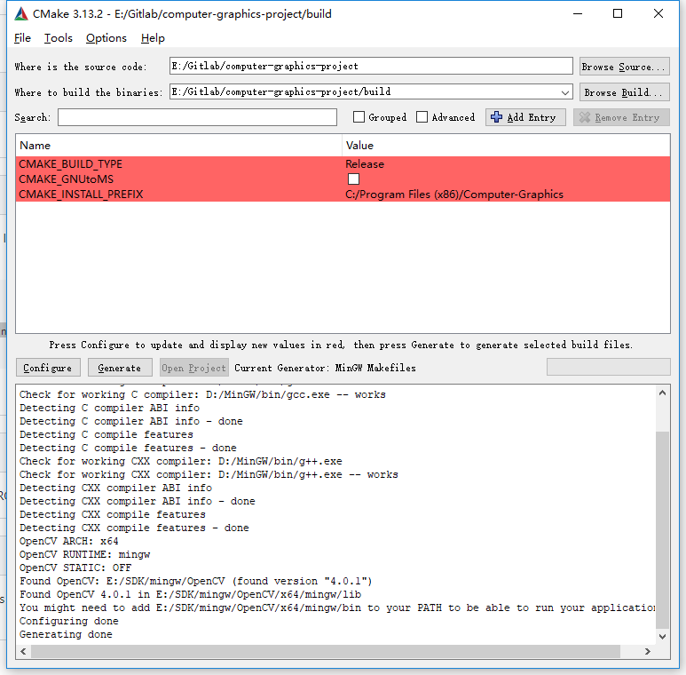
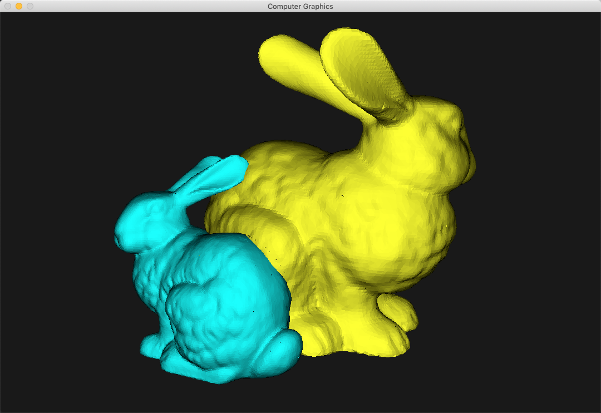
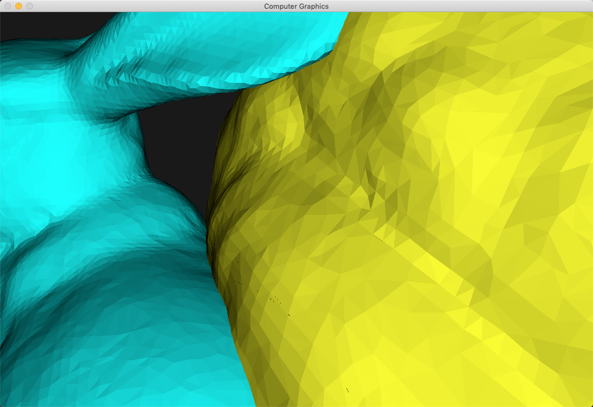
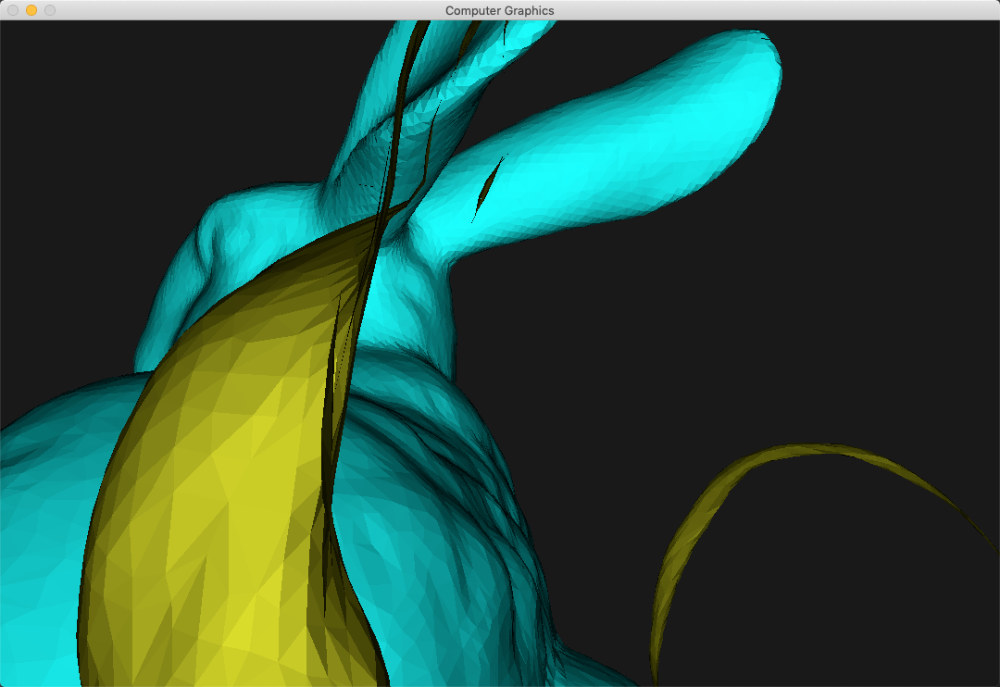
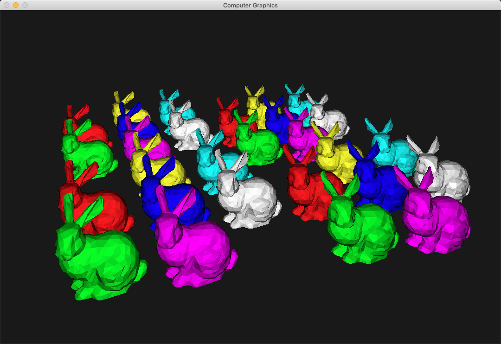

# 计算机图形学作业

张昊 21821082

实现了区间扫描线Z缓冲器算法。处理了**贯穿**，并对超出边界的三角形进行了正确的**裁剪**。同时增加了**Flat Shading**和**模型导入**功能。并利用**背面剔除**进行加速。在绘制40k+面片的兔子模型时，依然可以保持实时性（30fps，利用i5 7XXX CPU测试）。

## 编程环境

在**Ubuntu 18.04LTS**、**MacOS Mojave**、**Windows 10**上都进行了测试，能够成功编译运行（Windows上需要使用MinGW环境编译，未测试VC++）。测试场景放在`assets`文件夹内，运行时请注意路径是否正确。
主要依赖：

- [CMake](http://www.cmake.org/)
- [GLM](https://glm.g-truc.net/)
- [OpenCV](https://opencv.org/) 

利用[GLM](https://glm.g-truc.net/)进行矩阵运算，利用[OpenCV](https://opencv.org/)中的`highgui`作为GUI，只用于显示最后渲染的结果，保证了不会调用深度等和3D有关的操作。

### Ubuntu 18.04 LTS (推荐)

首先需要安装相应的依赖库

```bash
sudo apt-get update
sudo apt-get upgrade
sudo apt-get install cmake libglm libopencv-dev
```

安装好依赖之后可以进行编译：

```bash
mkdir build
cd build
cmake -DCMAKE_BUILD_TYPE=Release ..
make
```

**安装完依赖的第三方库后，Ubuntu和MacOS下可以执行run.sh编译运行**

### MacOS

#### 编译方法

首先需要安装相应的依赖库，在MacOS上推荐使用homebrew进行安装：

```bash
brew update
brew install cmake glm opencv
```

安装好依赖之后可以进行编译：

```bash
mkdir build
cd build
cmake -DCMAKE_BUILD_TYPE=Release ..
make
```

### Windows 10(比较复杂，不推介)

为了可以有比较好的可以执行，在Windows 10上需要使用[MinGW](http://mingw-w64.org/doku.php/download/mingw-builds)编译，。

依赖

- MinGW

#### 编译方法

首先需要安装MinGW，并配置好系统的环境变量`Path`,利用之后利用CMake以及MinGW中的GCC和GDB，编译GLM和OpenCV，并配置OpenCV的环境变量。修改`CMakeList.txt`中`include`和`lib`的相应位置

```Cmake
IF (WIN32)
    # Change to your include location
  set(INC_DIR E:\\SDK\\mingw\\include)
    include_directories(${INC_DIR})
    # Change to your lib location
  set(LINK_DIR E:\\SDK\\mingw\\lib)
    link_directories(${LINK_DIR})
    # Change to your OpenCV location
  set(OpenCV_DIR E:\\SDK\\mingw\\OpenCV)
endif ()
```

之后利用CMake生产makefile：



最后在命令行中编译

```bash
mingw32-make.exe -j4
```

### 运行

在命令行中运行，需带场景文件作为参数（提供两个示例场景`chaos.txt`和`so_many.txt`和.obj放在了assets文件夹下）

```bash
# ./Computer-Graphics [scene file]
./Computer-Graphics ../assets/so_many.txt
# or
./Computer-Graphics ../assets/chaos.txt
```

### 操作说明

`w,a,s,d`控制摄像头的移动，按下`鼠标左键`调整视角方向，`ESC`退出程序。

### 场景创建说明

必填项（区分大小写）

- 背景颜色（background 加四位小数）
- 几何体（mesh加OBJ相对执行文件的位置 end 结尾）

选填项

- 几何体的颜色和位置

#### Example

```bash
background 0.1 0.1 0.1 1.0
mesh ../assets/bunny_40k.obj
color 1 1 0 1
rotate 120 0 1 0
scale 15 15 15
end
```

## 数据结构说明

在实现算法时，我将整个程序分成了4个部分。

场景部分`SceneUtil.h` `SceneUtil.cpp`中保存了导入场景和几何体的数据结构`Scene`类和`Mesh`类，其中`Scene`中保存了所有需要处理的几何体，`Mesh`中储存了一个几何体的所有三角形面片，同时因为一个几何体的所有面片共用一个变换到世界坐标系的$Model$矩阵，所以还有保存了一个$4x4$的矩阵。这两个数据结构用来便于在每一帧更新矩阵时对三角形的索引和更新。

其次是多边形部分，这里保存的是和三角形面片`Triangle`类有关的数据结构，根据课堂上所说的内容，我添加了`Polygon`类和`Edge`类。其中`Edge`类保存了边的起始$x$位置，每一行需要更新的$dx$，$yMax$，$yMin$以及一个对`Polygon`类的指针。Polygon类保存了三角形的平面方程，颜色。Triangle中保存了它所对应的Polygon和Edge便于更新。

```cpp
class  Polygon {
public:
// Constructor
...
Polygon *before;
Polygon *next;
int polyID;
float A, B, C, D;
glm::vec4 color;
private:
bool in;
};

class  Edge {
public:
...
// Property
float x, dX;
int yMin, yMax;
Polygon *polyPtr;
};

class  Triangle {
public:
...
int polyID;
bool bFront, bPointInside;
glm::vec3 normal;
glm::vec4 color;
Edge edge[3];
Polygon polygon;
};
```

其次是用于保存结果的`Buffer`用来做颜色缓冲期，这里用了两种，其一是二位数组，一种是OpenCV中的`Mat`结构，也是一个二位数组。这两种结构唯一的着色方式是画点或者水平线段，符合区间扫描线的算法要求。

最后是光栅化的部分`Rasterization`类，这里保存了边表`ET`，活化边表`IET`，活化多边形表`IPL`。同时还有一个作为背景颜色的多边形`BG`和它所对应的左右边。下面简要介绍一下区间Z缓冲器算法的实现部分。

1. 遍历之前所说的三角形，构建边表。
2. 从下往上，首先将新的行的边加入活化边表中，然后进行排序。然后从左往右进行区间扫描，从背景多边形的左边开始，每次取出两个边，对它们的区间进行画线，其中如果左右的最前的多边形的ID不同，则说明出现了贯穿，这时候我使用二分查找，可以在$O(n) = log(n)$的时间复杂度内找到其中的交点，这里不能简单使用求交，因为这段区间内可能不止2个多边形贯穿了。
3. 遍历完一行之后，需要清空活化多边形表，并更新活化边表。

```cpp
class  Rasterization {
public:
// Constructor
Rasterization(int _height, int _width);
// Method
void  BuildETPT(Scene &scene);
void  Scan(FrameBuffer &fb);
private:
void  insertIPL(Polygon *&polygon);
void  removeIPL(Polygon *&polygon);
void  findClosestPolygonAndDraw(int leftX, int rightX, int y, FrameBuffer &fb) const;
inline  static  bool  edgePtrCmp(Edge *&a, Edge *&b);
int height, width;
// Property
vector<list<Edge *>> ET;
list<Edge *> AEL;
Polygon *IPL;
// Background
Polygon BG;
Edge X0, X1;
};
```

## 加速方法

- 利用了C++11的一些特性优化了循环的速度。
- 在处理贯穿情况时，利用二分法加快判断贯穿所在的位置。
- 使用了背面剔除，根据三角形的顶点顺序计算法向量，结合视角方向判断三角形是不是背面，对背面的三角形进行了剔除。

## 示例

处理了多边形贯穿情况（此场景每个兔子40k个左右面片，共2个）


交界处细节，同时可以反映对多边形的边缘的裁剪


处理了深度$z$方向上的裁剪，同时对背面的多边形进行了剔除


利用自定义的场景文件，可以同时导入多个OBJ文件，同时自定义颜色，位置（此场景每个兔子1k个左右面片，共32个）


## Future Work

还可以进一步改进的地方在于

- 界面的GUI
- 利用并行进一步提高效率
- 加入更高级的着色方式
